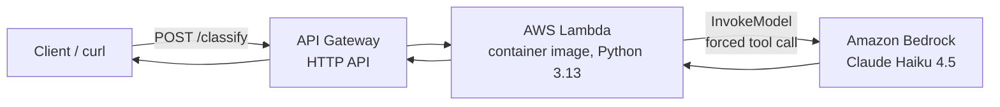

# clip-classifier-aws

A serverless LLM classification service on AWS. It takes a free-text description of a
gaming clip and returns a set of tags drawn from a fixed, controlled vocabulary - the
model is constrained to that vocabulary and proposes a new tag only when nothing fits.

```
POST /classify  {"description": "clutch 1v3 retake to win the final round",
                 "game": "War Robots Frontiers"}

->              {"tags": ["war robots frontiers", "clutch", "highlight"],
                 "proposed_tag": null}
```

**What this demonstrates:** Deployed a schema-constrained LLM
classification service on AWS - Amazon Bedrock (Claude) behind AWS Lambda and API
Gateway, with the function packaged as a Docker container image, least-privilege IAM,
and the whole stack provisioned as infrastructure-as-code with AWS SAM.

## Architecture



- **Amazon Bedrock** runs the model (Claude Haiku 4.5), replacing a local `claude` CLI
  call in the original tool. Managed inference, pay-per-token.
- **AWS Lambda** runs the classification code - serverless, scales to zero, packaged as
  a **container image** (also serves as hands-on Docker experience).
- **API Gateway (HTTP API)** fronts the Lambda as a public `POST /classify` endpoint.
- **AWS SAM** defines the whole stack (`template.yaml`) and deploys it with `sam deploy`.

Output is constrained to the vocabulary by forcing a single tool call whose input schema
is the classification schema (a `tags` enum plus a nullable `proposed_tag`) - the reliable
way to get schema-valid JSON from Claude on Bedrock. See [docs/DESIGN.md](docs/DESIGN.md)
for the decisions, trade-offs, and operational lessons behind this.

## Tech stack

Amazon Bedrock, AWS Lambda, Amazon API Gateway, IAM, Docker, AWS SAM (CloudFormation),
Python 3.13, boto3.

## Repository layout

```
template.yaml        SAM template: Lambda (container image) + HTTP API + IAM
app/
  app.py             Lambda handler: parse request -> classify -> JSON tags
  classify.py        System prompt + constrained schema + Bedrock forced-tool runner
  tags.py            Controlled-vocabulary loader (TagVocab)
  tags.json          The controlled tag vocabulary
  Dockerfile         public.ecr.aws/lambda/python:3.13 base image
docs/DESIGN.md       Deep dive: architecture, decisions, lessons
```

The classification logic (`classify.py`, `tags.py`, `tags.json`) is ported from the
`clip-db` project; only the model runner was swapped - from a local `claude` CLI call to
a Bedrock `InvokeModel` call - reusing the runner-injection seam the original was built with.

## Deploy it yourself

Prerequisites: an AWS account with Bedrock access to a Claude model in `us-east-1`, the
AWS CLI configured, Docker, and the AWS SAM CLI.

```bash
sam build
sam deploy --guided     # first time; answer Y to managed ECR + IAM role creation
```

The deploy Outputs print `ClassifyUrl`. Call it:

```bash
curl -sS -X POST "$CLASSIFY_URL" \
  -H 'Content-Type: application/json' \
  -d '{"description":"whiffed every shot then fell off the map, hilarious"}'
```

### Tear it down

```bash
sam delete --stack-name clip-classifier-aws --region us-east-1
```

## Cost and status

Lambda, API Gateway, and ECR sit within the AWS free tier for hobby use; Bedrock is
pay-per-token (pennies for testing). This is a learning and portfolio project - the
deployed endpoint is public and unauthenticated, so it is torn down when not in use. See
[docs/DESIGN.md](docs/DESIGN.md) for the security note and planned enhancements.
